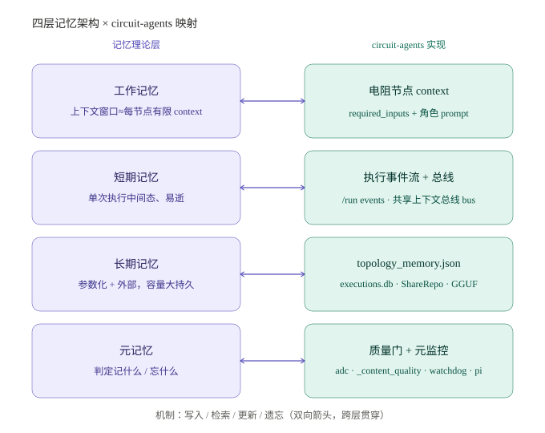
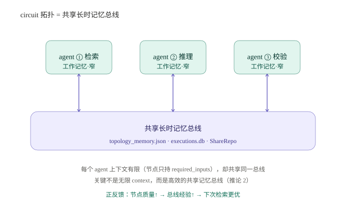

# 增强大模型能力：记忆架构视角

> 本文把认知科学的"记忆分层"框架映射到 agent 系统，并以 **circuit-agents** 项目为实例验证。结论不是"更大上下文窗口"，而是"更优的记忆架构"。

## 2. 工作记忆与长时记忆的类比

**核心观点**

- 上下文 ≈ 工作记忆，容量有限但关键；
- 参数化知识与外部存储 ≈ 长时记忆，容量大且持久；
- 多 agent 协作 ≈ 多个工作记忆有限的人共享同一套长时记忆。

**推论**

- 工作记忆越强，越能进行复杂加工，从而沉淀更丰富的长时记忆，形成正反馈循环。
- 多 agent 系统的关键不是每个 agent 上下文无限大，而是建设高效的**共享长时记忆总线**。
- 系统应分层：工作记忆、短期记忆、长期记忆、元记忆，并设计好写入、检索、更新、遗忘机制。

## 3. 最终结论

增强大模型能力不应只追求"上下文窗口更大"，而应同时提升：

1. **工作记忆质量**（长上下文中注意力、检索、推理能力）
2. **长时记忆丰富度**（知识库、经验库、参数知识）
3. **工作记忆与长时记忆的交互效率**（写入、检索、更新）
4. **多 agent 共享记忆架构**（让不同分工的智能体协同一致）

这样才能构建真正具备认知架构的智能系统，而不仅仅是一个"长上下文模型"。

## 4. 联动 circuit-agents

circuit-agents 并非从零"对标"上述理论——读核心模块（`compiler/topology_memory.py` / `compiler/share.py` / `execution_store.py` / `compiler/llm_agents.py` / `runtime.py`）后确认：其已**散落着对应的真实实现**。

### 4.1 四层映射

| 记忆层 | 理论定义 | circuit-agents 真实对应 |
|---|---|---|
| **工作记忆** | 上下文窗口，有限但关键 | 每个电阻节点的 `required_inputs` 窄上下文 + `llm_agents.CAPABILITY_PROMPTS` 角色 prompt（节点刻意只持所需输入） |
| **短期记忆** | 单次执行中间态、易逝 | `/run` 的 `events` 流 + 电路"共享上下文总线" bus（同层节点写最新快照，跨层顺次累积） |
| **长期记忆** | 参数化 + 外部，容量大持久 | 参数化：`qwen2.5:7b` GGUF 权重、`compiler/` 逻辑；外部：`topology_memory.json` / `executions.db`（SQLite）/ `ShareRepo` |
| **元记忆** | 判定记什么 / 忘什么 | 质量门 `adc`、`_content_quality`（内容质量打分）、`watchdog` 跨轮劣化标记、`pi_heartbeat` f(π) 健康自知 |

### 4.2 共享长时记忆总线

电路拓扑本身就是多 agent（电阻节点）的**共享长时记忆总线**：每个节点只持 `required_inputs`（工作记忆刻意有限），却读写同一张电路的共享状态。这直接印证推论 2——关键不是无限 context，而是高效的共享总线。

**正反馈闭环**：节点质量↑（本地 7B 内容打分 0.949）→ 总线经验↑（`topology_memory` 记录成功拓扑）→ 下次 `recall` 检索更优 → 首跑质量↑。

### 4.3 诚实缺口

对照第 3 节四条增强路径，当前实现仍缺：

1. **工作记忆质量**：节点内已窄（方向正确），但缺**检索增强 / RAG**——节点 context 仅来自上游 `required_inputs`，未从长时记忆检索补充。
2. **长时记忆丰富度**：已有 `topology_memory` + `executions.db` + `ShareRepo`，但经验库薄（FIFO 100、Jaccard 关键词匹配，无语义/向量检索；mentor 只在失败案例上训练）。
3. **交互效率**：写入（`record`）有、检索（Jaccard）有、更新（`replay` / mentor）有、遗忘（FIFO）有；但**缺统一 MemoryBus 抽象**，三套存储各自为政，且 `recall` 未在 `/run` 规划时自动咨询（闭环未闭合——目前只写不读）。
4. **多 agent 共享**：电路总线 + ShareRepo 已有雏形，但跨 run 共享的是**拓扑**而非**知识**；多 agent 各自独立 session，无服务级实时共享。

### 4.4 最高杠杆下一步

**闭合正反馈环**：让 `plan.py` 在编译前自动 `topology_memory.recall(goal)`，命中则直接复用成功拓扑。

- 零新依赖（复用现有 `record` / `recall`）；
- 让"共享长时记忆总线"第一次被**读**起来（目前只写不读）；
- 省一次 LLM 编排、提升首跑质量，最贴合"先让总线高效读写、再谈丰富度"的理论核心。

---

*附图：详见同目录 `memory_layers.svg`（四层映射）与 `memory_bus.svg`（共享总线）。*
